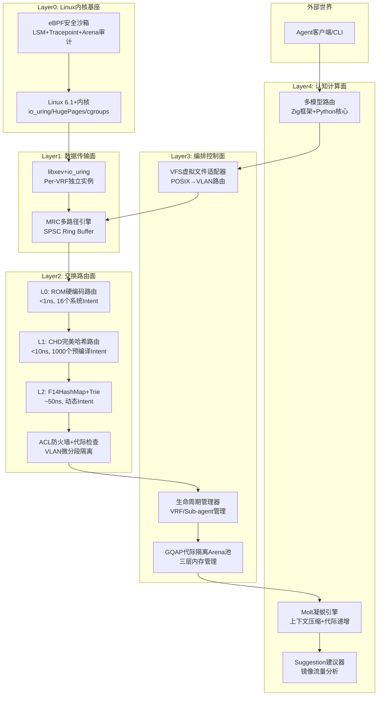

# LingNet Agent OS V2.2 标准软件开发路线图（框架到落地）
**文档版本**: v2.2-roadmap-final-20260524  
**冻结日期**: 2026-05-24  
**总工期**: 36周（含4周缓冲）  
**基线**: 已合并V2.0/V2.2所有规格书，7项高优先级问题已修复  
**核心目标**: 交付生产级可用的eBPF增强型多模型Agent OS，满足100K并发Sub-agent、99.99%可用性要求

---

## 一、系统整体架构图


---

## 二、核心子系统架构图
### 2.1 GQAP代际隔离Arena池架构
```mermaid
flowchart LR
    subgraph GQAP三层池架构
        CP[Common Pool<br/>L0/L1专用<br/>不清零, O(1)操作]
        QP[Quarantine Pool<br/>L2退役暂存区<br/>按generation标记]
        LP[L2 Pool<br/>已消毒可复用<br/>后台清零完成]
    end

    subgraph 数据流
        L0L1[L0/L1 Skill] -->|分配/释放| CP
        L2[L2 Dynamic Skill] -->|分配| LP
        L2 -->|释放| QP
        QP -->|RCU宽限期后| Sanitizer[Sanitizer线程<br/>Core 6-7绑定<br/>AVX2并行清零]
        Sanitizer -->|消毒完成| LP
    end
```

### 2.2 多模型路由Zig+Python混合架构
```mermaid
flowchart TD
    subgraph Zig层(L1-L3)
        Config[配置验证<br/>comptime TOML解析]
        MRC_Route[MRC路由<br/>Intent→VLAN映射]
        Queue[请求排队<br/>Credit流控]
        Timeout[超时控制<br/>rdtsc精度计时]
        Stats[错误统计<br/>P99直方图]
    end

    subgraph Python层(L4)
        HTTP[HTTP客户端<br/>aiohttp/httpx]
        Token[Token计数<br/>tiktoken/jieba]
        Cost[成本计算<br/>实时USD计费]
        Strategy[策略引擎<br/>统一/智能/竞速]
        Merge[结果合并<br/>首成功返回]
    end

    Skill[Skill Handler] -->|mrc.llm.request()| Config
    Config --> MRC_Route
    MRC_Route --> Queue
    Queue --> Timeout
    Timeout -->|零拷贝Ring Buffer| Strategy
    Strategy --> HTTP
    HTTP -->|多提供商并发| OpenAI[OpenAI]
    HTTP --> Anthropic[Anthropic]
    HTTP --> DeepSeek[DeepSeek]
    HTTP --> Custom[自定义提供商]
    Merge -->|响应| Stats
    Stats -->|返回结果| Skill
```

### 2.3 生产环境部署架构
```mermaid
flowchart TD
    LB[负载均衡器<br/>Nginx/HAProxy]
    
    subgraph LingNet集群(3节点)
        Node1[Node 1<br/>16C/32G<br/>Linux 6.1+]
        Node2[Node 2<br/>16C/32G<br/>Linux 6.1+]
        Node3[Node 3<br/>16C/32G<br/>Linux 6.1+]
    end
    
    subgraph 监控与日志
        Prometheus[Prometheus<br/>指标采集]
        Grafana[Grafana<br/>可视化大盘]
        ELK[ELK Stack<br/>日志收集分析]
    end
    
    LB --> Node1
    LB --> Node2
    LB --> Node3
    
    Node1 --> Prometheus
    Node2 --> Prometheus
    Node3 --> Prometheus
    Prometheus --> Grafana
    
    Node1 --> ELK
    Node2 --> ELK
    Node3 --> ELK
```

---

## 三、路线图总览
| 阶段 | 时间 | 核心任务 | 关键里程碑 | 验收通过率 | 负责人 |
|:---|:---|:---|:---|:---|:---|
| **M0: 准备与基线搭建** | Week 1-2 | 工具链锁定、环境搭建、CI/CD | 代码仓库初始化、CI流水线上线 | 100% | 项目经理+架构师 |
| **M1: 核心基础设施** | Week 3-6 | GQAP Arena、eBPF管线、数据面 | 数据面20M IOPS、eBPF加载成功 | 100% | 系统工程师+安全工程师 |
| **M2: 路由面闭环** | Week 7-12 | 三级路由表、L0保护、热替换 | L1查表<10ns、热替换抖动<100ns | 100% | 算法工程师+系统工程师 |
| **M3: 编排面增强** | Week 13-18 | VRF生命周期、GQAP集成、凝蜕 | 分神创建<100ns、L2 deinit<50ns | 100% | 系统工程师+全栈工程师 |
| **M4: 认知面与多模型** | Week 19-24 | 跨语言桥接、多模型路由、竞速 | 竞速首响应<2s、智能路由P99<3s | 100% | Python工程师+全栈工程师 |
| **M5: 系统集成与测试** | Week 25-30 | CLI工具、压力测试、安全渗透 | 72h零泄漏、eBPF渗透零绕过 | 99.9% | 测试工程师+安全工程师 |
| **M6: 预发布与调优** | Week 31-34 | 性能调优、部署文档、灰度发布 | eBPF开销<8%、灰度72h稳定 | 99.99% | DevOps+全团队 |
| **M7: 正式发布** | Week 35-36 | 全量发布、运维手册、社区支持 | v2.2正式版发布 | - | 项目经理+全团队 |

---

## 四、分阶段详细计划（含交付物与验收标准）
### M0: 准备与基线搭建（Week 1-2）
**核心目标**: 建立统一的开发环境与质量保障体系，锁定所有依赖版本

| 任务ID | 子任务 | 责任人 | 交付物 | 验收标准 |
|:---|:---|:---|:---|:---|
| M0-01 | 工具链版本锁定 | 架构师 | `toolchain.lock` | - Zig 0.17-dev.329+<br>- Python 3.12.3 (nogil)<br>- Linux 6.1.85内核<br>- GCC 13.2.0 |
| M0-02 | 代码仓库初始化 | 开发组长 | GitHub/GitLab仓库 | 完全匹配V2.2代码框架书目录结构 |
| M0-03 | CI/CD流水线搭建 | DevOps | `.github/workflows/` | - 自动编译主程序和eBPF对象<br>- 自动运行单元测试和基准测试<br>- 自动生成二进制包和Docker镜像 |
| M0-04 | 单元测试框架 | 测试工程师 | `test/`目录 | - 支持rdtsc精度计时<br>- 支持comptime测试<br>- 支持性能基准测试 |
| M0-05 | 开发环境配置 | 全团队 | `docs/setup.md` | 按照文档可在30分钟内完成开发环境搭建 |
| M0-06 | 任务拆分与分配 | 项目经理 | Jira任务板 | 所有模块拆分为≤1周的子任务，明确责任人 |
| M0-07 | 代码规范制定 | 架构师 | `docs/coding_standards.md` | 包含Zig和Python代码规范、提交规范 |

**Go/No-Go决策点**: 所有开发人员环境搭建完成，CI/CD流水线首次运行成功

---

### M1: 核心基础设施（Week 3-6）
**核心目标**: 完成数据面与内存管理核心，验证eBPF沙箱基础能力

| 任务ID | 子任务 | 责任人 | 交付物 | 验收标准 |
|:---|:---|:---|:---|:---|
| **GQAP代际隔离Arena池** | | | | |
| M1-01 | Common Pool实现 | 系统工程师 | `sdk/arena_gqap.zig` | - MPMC无锁队列<br>- init/deinit <100ns/50ns |
| M1-02 | Quarantine Pool实现 | 系统工程师 | `sdk/arena_gqap.zig` | - 按generation标记<br>- RCU宽限期管理 |
| M1-03 | L2 Pool实现 | 系统工程师 | `sdk/arena_gqap.zig` | - 已消毒内存块管理<br>- 溢出处理逻辑 |
| M1-04 | AVX2 sanitizer线程 | 系统工程师 | `sdk/arena_gqap.zig` | - 绑定Core 6-7<br>- ~3us/64KB清零速度 |
| M1-05 | SSE2回退实现 | 系统工程师 | `sdk/arena_gqap.zig` | - 自动检测CPU指令集<br>- 不支持AVX2时自动回退 |
| M1-06 | GQAP基准测试 | 测试工程师 | `bench/bench_gqap.zig` | 所有性能指标达到V2.2规格书要求 |
| **eBPF编译与加载管线** | | | | |
| M1-07 | build.zig eBPF目标集成 | DevOps | `build.zig` | `zig build`成功生成所有3个BPF对象 |
| M1-08 | ebpf_loader.zig实现 | 安全工程师 | `tools/ebpf_loader.zig` | - 加载BPF字节码到内核<br>- 初始化BPF maps |
| M1-09 | cgroup ID写入逻辑 | 安全工程师 | `src/boot.zig` | 启动时自动将当前进程cgroup ID写入BPF map |
| M1-10 | 内核版本预检与降级 | 安全工程师 | `src/boot.zig` | - 内核<6.1自动降级为Seccomp-BPF<br>- 内核<5.2降级为纯Seccomp |
| **数据面MRC引擎** | | | | |
| M1-11 | SPSC Ring Buffer实现 | 系统工程师 | `sdk/mrc.zig` | - 缓存行对齐<br>- 无锁读写<br>- 域内P99延迟<1μs |
| M1-12 | Ready-List事件聚合 | 系统工程师 | `sdk/mrc.zig` | - Per-CPU分片<br>- 批量事件处理 |
| M1-13 | Credit-based流控 | 系统工程师 | `sdk/mrc.zig` | - 双触发条件<br>- 零丢包 |
| M1-14 | Per-VRF io_uring实例 | 系统工程师 | `sdk/mrc.zig` | - SQPOLL内核线程<br>- 跨域延迟<10μs |
| M1-15 | MRC基准测试 | 测试工程师 | `bench/bench_mrc.zig` | 域内SPSC吞吐>20M IOPS |
| **eBPF基础监控** | | | | |
| M1-16 | runtime_monitor.bpf.c实现 | 安全工程师 | `ebpf/runtime_monitor.bpf.c` | - 分级采样逻辑<br>- cgroup过滤 |
| M1-17 | 用户态事件处理 | 安全工程师 | `src/ebpf_handler.zig` | - 从perf buffer读取事件<br>- 按风险等级分级处理 |
| M1-18 | eBPF基础测试 | 测试工程师 | `test/ebpf_test.zig` | 高危系统调用100%被捕获 |

**Go/No-Go决策点**: 数据面性能达标，eBPF程序成功加载并捕获系统调用

---

### M2: 路由面闭环（Week 7-12）
**核心目标**: 完成三级路由表与L0安全保护，实现零抖动热替换

| 任务ID | 子任务 | 责任人 | 交付物 | 验收标准 |
|:---|:---|:---|:---|:---|
| **CHD完美哈希生成器** | | | | |
| M2-01 | CHD算法实现 | 算法工程师 | `tools/phf_generator.zig` | - 1000 Intent零碰撞<br>- 生成时间<30s |
| M2-02 | 编译期集成 | 算法工程师 | `build.zig` | 编译时自动生成routing_table.zig |
| M2-03 | 超时回退F14HashMap | 算法工程师 | `tools/phf_generator.zig` | CHD生成超时自动回退到全动态模式 |
| **三级路由表** | | | | |
| M2-04 | L0 ROM硬编码路由 | 系统工程师 | `src/switch.zig` | - 直接索引<br>- 查表<1ns |
| M2-05 | L1 CHD哈希路由 | 系统工程师 | `src/switch.zig` | - 完美哈希<br>- 查表<10ns |
| M2-06 | L2 F14HashMap+Trie | 系统工程师 | `src/switch.zig` | - 动态添加删除<br>- 通配符匹配<br>- 查表<50ns |
| M2-07 | 全路径generation检查 | 系统工程师 | `src/switch.zig` | - 所有数据包进入handler前检查<br>- 旧包自动丢弃<br>- 检查开销<2ns |
| **L0代码段保护** | | | | |
| M2-08 | linker.ld脚本编写 | 系统工程师 | `linker.ld` | - 定义.lingnet_l0段<br>- 4KB对齐 |
| M2-09 | 启动时mprotect保护 | 系统工程师 | `src/boot.zig` | 启动时自动将L0段设置为只读可执行 |
| M2-10 | 篡改检测逻辑 | 安全工程师 | `src/boot.zig` | 写入L0段触发SIGSEGV |
| **代际热替换** | | | | |
| M2-11 | RCU宽限期管理 | 系统工程师 | `src/switch.zig` | - 100ms宽限期<br>- 旧表延迟释放 |
| M2-12 | 原子指针切换 | 系统工程师 | `src/switch.zig` | - 无锁切换<br>- 抖动<100ns P99 |
| M2-13 | 热替换基准测试 | 测试工程师 | `bench/bench_route.zig` | 10K次切换零崩溃 |
| **自动晋升机制** | | | | |
| M2-14 | 访问统计收集 | 系统工程师 | `src/orchestrator.zig` | 每分钟统计每个Intent的访问次数 |
| M2-15 | 安全等级校验 | 安全工程师 | `src/orchestrator.zig` | 连续72h无安全违规才可晋升 |
| M2-16 | 后台CHD重计算 | 系统工程师 | `src/orchestrator.zig` | 低优先级后台线程执行，不阻塞数据面 |

**Go/No-Go决策点**: 路由面所有性能指标达标，10K次热替换零故障

---

### M3: 编排面增强（Week 13-18）
**核心目标**: 完成VRF与Sub-agent生命周期管理，集成GQAP到Skill系统

| 任务ID | 子任务 | 责任人 | 交付物 | 验收标准 |
|:---|:---|:---|:---|:---|
| **VRF生命周期管理** | | | | |
| M3-01 | unshare命名空间隔离 | 系统工程师 | `src/orchestrator.zig` | - CLONE_NEWNS+CLONE_NEWPID<br>- 隔离生效 |
| M3-02 | cgroups v2资源限制 | 系统工程师 | `src/orchestrator.zig` | - CPU/内存硬限制<br>- 死循环CPU波动<5% |
| M3-03 | 独立路由表初始化 | 系统工程师 | `src/orchestrator.zig` | - L0/L1拷贝<br>- L2空表<br>- VRF创建<300μs |
| **Sub-agent池化管理** | | | | |
| M3-04 | 预分配池初始化 | 系统工程师 | `src/orchestrator.zig` | - 10K x 64KB预分配<br>- 池化创建<100ns |
| M3-05 | 快速创建/销毁 | 系统工程师 | `src/orchestrator.zig` | - 池化销毁<50ns<br>- 系统创建<10μs |
| M3-06 | 池耗尽回退系统分配 | 系统工程师 | `src/orchestrator.zig` | 池耗尽时自动从系统分配内存 |
| **GQAP Skill集成** | | | | |
| M3-07 | L0/L1使用TrustedArena | 全栈工程师 | 所有L0/L1 Skill代码 | 编译期验证 |
| M3-08 | L2强制使用UntrustedArena | 全栈工程师 | `sdk/sandbox.zig` | L2 Skill使用TrustedArena编译失败 |
| M3-09 | 编译期类型检查 | 全栈工程师 | `sdk/sandbox.zig` | 自动检查Skill代码中的Arena类型 |
| M3-10 | 内存溢出防护 | 系统工程师 | `sdk/arena_gqap.zig` | 超过max_arena_size时返回错误 |
| **凝蜕管线** | | | | |
| M3-11 | 代际递增触发 | 系统工程师 | `src/cognitive.zig` | 自动触发或手动触发 |
| M3-12 | 离散页收集 | 系统工程师 | `src/cognitive.zig` | 收集当前代的所有内存页 |
| M3-13 | memfd FD传递 | 系统工程师 | `src/cognitive.zig` | - FD传递+mmap<500μs<br>- 零拷贝 |
| **VFS适配器** | | | | |
| M3-14 | POSIX语义映射 | 全栈工程师 | `sdk/vfs.zig` | 所有POSIX调用正确映射到Intent |
| M3-15 | VLAN路由转发 | 全栈工程师 | `sdk/vfs.zig` | 文件操作自动路由到对应VLAN |
| M3-16 | 权限控制 | 安全工程师 | `sdk/vfs.zig` | 非法路径访问被拦截 |

**Go/No-Go决策点**: 100K Sub-agent并发测试通过，凝蜕管线稳定运行

---

### M4: 认知面与多模型路由（Week 19-24）
**核心目标**: 完成Zig-Python跨语言桥接，实现多模型并行接入与竞速模式

| 任务ID | 子任务 | 责任人 | 交付物 | 验收标准 |
|:---|:---|:---|:---|:---|
| **跨语言CFFI桥接** | | | | |
| M4-01 | C接口定义 | 全栈工程师 | `src/cognitive.zig` | 清晰的C函数接口 |
| M4-02 | memfd零拷贝传递 | 全栈工程师 | `src/cognitive.zig`、`python/router_core.py` | 单次调用开销<4μs |
| M4-03 | 异步请求处理 | Python工程师 | `python/router_core.py` | 支持异步请求和流式响应 |
| **多模型路由核心** | | | | |
| M4-04 | 提供商配置解析 | Python工程师 | `python/router_core.py` | 支持1+7+2+2+8所有提供商配置 |
| M4-05 | 统一API适配器 | Python工程师 | `python/model_clients/` | - OpenAI兼容<br>- Anthropic原生<br>- Google原生 |
| M4-06 | Token计数与计费 | Python工程师 | `python/router_core.py` | 计费精度±1% |
| M4-07 | 错误自动重试 | Python工程师 | `python/router_core.py` | 支持配置重试次数和重试间隔 |
| **三种路由策略** | | | | |
| M4-08 | 统一配置模式 | Python工程师 | `python/router_core.py` | 所有Agent共享全局配置 |
| M4-09 | 智能路由模式 | Python工程师 | `python/router_core.py` | 按权重分配流量 |
| M4-10 | 竞速模式 | Python工程师 | `python/router_core.py` | - 首成功返回<br>- 竞速首响应<2s |
| **单Agent独立配置** | | | | |
| M4-11 | VRF级模型配置覆盖 | 全栈工程师 | `src/orchestrator.zig` | 不同Agent可使用不同模型配置 |
| M4-12 | 独立预算控制 | Python工程师 | `python/router_core.py` | 支持单Agent级别的预算限制 |
| M4-13 | 独立降级链 | Python工程师 | `python/router_core.py` | 每个Agent有独立的降级链 |
| **健康检查与故障转移** | | | | |
| M4-14 | 后端健康检查 | Python工程师 | `python/router_core.py` | 每30秒检查一次后端可用性 |
| M4-15 | 自动熔断与恢复 | Python工程师 | `python/router_core.py` | 错误率超过阈值自动熔断 |
| M4-16 | 故障转移 | Python工程师 | `python/router_core.py` | 故障转移时间<1s |

**Go/No-Go决策点**: 多模型路由所有模式正常工作，竞速模式首响应达标

---

### M5: 系统集成与测试（Week 25-30）
**核心目标**: 完成系统集成与全面测试，修复所有发现的问题

| 任务ID | 测试类型 | 测试内容 | 责任人 | 交付物 | 验收标准 |
|:---|:---|:---|:---|:---|:---|
| M5-01 | 单元测试 | 所有模块单元测试 | 测试工程师 | 单元测试报告 | 代码覆盖率≥90%，核心模块100% |
| M5-02 | 集成测试 | 模块间接口测试、端到端流程测试 | 测试工程师 | 集成测试报告 | 所有用例通过率100% |
| M5-03 | 性能测试 | 数据面、路由面、编排面全性能压测 | 测试工程师 | 性能基准报告 | 所有性能指标达到V2.2规格书要求 |
| M5-04 | 压力测试 | 72h持续高压测试、极限并发测试 | 测试工程师 | 压力测试报告 | - 72h零内存泄漏<br>- 100K Sub-agent并发稳定运行<br>- CPU使用率<80% |
| M5-05 | 安全渗透测试 | eBPF沙箱绕过测试、Skill权限提升测试、网络攻击测试 | 安全工程师 | 安全渗透报告 | - eBPF监控零绕过<br>- 所有沙箱限制生效<br>- 无高危安全漏洞 |
| M5-06 | 降级测试 | 不同内核版本降级测试、Zig版本降级测试 | 测试工程师 | 降级测试报告 | 所有降级路径正常工作，功能损失符合预期 |
| M5-07 | CLI工具测试 | 所有lingnet-cli命令测试 | 测试工程师 | CLI测试报告 | 所有命令正常工作，输出符合预期 |
| M5-08 | 问题修复 | 修复所有测试发现的问题 | 全团队 | 问题修复报告 | 所有高危和中危问题全部修复 |

**Go/No-Go决策点**: 所有测试通过率≥99.9%，无高危和中危漏洞

---

### M6: 预发布与调优（Week 31-34）
**核心目标**: 完成性能调优与生产环境准备，进行灰度发布

| 任务ID | 子任务 | 责任人 | 交付物 | 验收标准 |
|:---|:---|:---|:---|:---|
| M6-01 | 性能调优 | 全系统性能调优 | 全团队 | 性能调优报告 | eBPF整体开销<8%，所有性能指标优于目标值10% |
| M6-02 | 部署文档编写 | 部署流程、系统要求、配置说明 | DevOps | `docs/deployment.md`、`docs/installation.md` | 按照文档可在30分钟内部署完成 |
| M6-03 | 运维手册编写 | 日常运维、监控指标、故障排查、备份恢复 | DevOps | `docs/operations.md`、`docs/troubleshooting.md` | 包含所有常见问题的排查方法 |
| M6-04 | 生产环境准备 | 生产环境配置、监控大盘、告警规则 | DevOps | 生产环境配置模板、Grafana大盘 | Prometheus+Grafana监控大盘包含所有核心指标 |
| M6-05 | 灰度发布计划 | 灰度策略、回滚方案、风险评估 | 项目经理 | 灰度发布计划 | 明确的灰度阶段和回滚触发条件 |
| M6-06 | 灰度环境部署 | 灰度环境搭建、配置同步 | DevOps | 灰度环境 | 与生产环境配置一致 |
| M6-07 | 灰度运行与监控 | 10%流量灰度运行72h | 全团队 | 灰度运行报告 | 72h稳定运行，无重大问题 |
| M6-08 | 灰度问题修复 | 修复灰度期间发现的问题 | 全团队 | 问题修复报告 | 所有灰度发现的问题全部修复 |

**Go/No-Go决策点**: 灰度环境72h稳定运行，无重大问题

---

### M7: 正式发布（Week 35-36）
**核心目标**: 完成全量发布与社区支持

| 任务ID | 子任务 | 责任人 | 交付物 |
|:---|:---|:---|:---|
| M7-01 | 正式版编译与打包 | 生成正式版二进制包、Docker镜像 | DevOps | v2.2.0正式版发布包 |
| M7-02 | 发布公告编写 | 版本特性、改进、已知问题 | 项目经理 | GitHub Release、社区公告 |
| M7-03 | 生产环境全量发布 | 按照灰度发布计划进行全量切换 | DevOps | 全量发布完成 |
| M7-04 | 社区支持 | GitHub Issues响应、Discord社区支持 | 全团队 | 24小时内响应社区问题 |
| M7-05 | 后续迭代规划 | v2.3开发路线图制定 | 架构师+项目经理 | v2.3开发路线图 |

---

## 五、风险管理与备案策略
### 5.1 风险矩阵与应对措施
| 风险ID | 风险描述 | 概率 | 影响 | 应对策略 | 触发条件 | 负责人 |
|:---|:---|:---|:---|:---|:---|:---|
| R01 | Zig 0.17正式版延迟发布 | 中 | 高 | 切换到Zig 0.16+libxev备案路径 | 0.17正式版延迟>3个月 | 架构师 |
| R02 | eBPF LSM内核不支持 | 中 | 中 | 自动降级为Seccomp-BPF+tracepoint | 生产环境内核<5.7 | DevOps |
| R03 | GQAP Quarantine池溢出 | 低 | 高 | 紧急同步清零+告警，限制L2 Skill创建速度 | Quarantine池使用率>90% | 开发组长 |
| R04 | 多模型竞速风暴 | 中 | 中 | 令牌桶限流+预算硬上限 | 单小时请求量超过阈值10倍 | 测试工程师 |
| R05 | AVX2指令集缺失 | 低 | 低 | 自动回退到SSE2或标量清零 | CPU不支持AVX2 | 架构师 |
| R06 | Python GIL瓶颈 | 中 | 中 | 使用Python 3.13 nogil版本或子解释器 | CFFI延迟>1ms | Python工程师 |
| R07 | eBPF验证器拒绝加载 | 低 | 高 | 简化BPF代码，分阶段加载 | 内核版本差异导致验证失败 | 安全工程师 |

### 5.2 备案路径详细计划
| 备案路径 | 触发条件 | 工期变化 | 功能损失 |
|:---|:---|:---|:---|
| **路径A: 全功能** | 所有条件满足 | 36周 | 无 |
| **路径B: eBPF降级** | 内核<5.7 | 34周(-2) | 无LSM路径解析，仅tracepoint监控 |
| **路径C: Zig 0.16** | Zig 0.17延迟>3个月 | 36周 | 无内置libxev，需独立集成 |
| **路径D: 无eBPF** | 内核<5.2 | 34周(-2) | 仅Seccomp+Landlock，无eBPF监控 |

---

## 六、验收标准总表
### 6.1 性能验收标准
| 类别 | 指标 | 目标值 |
|:---|:---|:---|
| **数据面** | 域内SPSC吞吐 | >20M IOPS |
| | 域内P99延迟 | <1μs |
| | 跨域延迟 | <10μs |
| **路由面** | L0查表 | <1ns |
| | L1查表 | <10ns |
| | L2查表 | <50ns |
| | 热替换抖动 | <100ns P99 |
| **编排面** | 分神创建(池) | <100ns |
| | 分身创建 | <300μs |
| | Untrusted Arena deinit | <50ns |
| | Background sanitize | ~3us/64KB |
| **认知面** | 竞速首响应 | <2s |
| | 智能路由P99 | <3s |
| | 凝蜕管线overhead | <100μs |
| **eBPF开销** | 整体性能影响 | <8% |

### 6.2 安全验收标准
| 类别 | 要求 |
|:---|:---|
| **L0安全** | 代码段只读保护，不可篡改 |
| **L1安全** | Seccomp-BPF+Landlock沙箱 |
| **L2安全** | eBPF分级监控+强制Arena清零 |
| **隔离性** | 死循环CPU波动<5%，内存隔离生效 |
| **渗透测试** | 无高危漏洞，eBPF监控零绕过 |

### 6.3 可用性验收标准
| 指标 | 目标值 |
|:---|:---|
| 系统可用性 | 99.99% |
| 故障转移时间 | <1s |
| 热替换中断时间 | 0 |
| 72h压力测试 | 零崩溃、零内存泄漏 |

---

## 七、产品落地计划
### 7.1 灰度发布计划
1. **Day 1-3**: 10%流量灰度，仅内部用户使用
2. **Day 4-7**: 30%流量灰度，开放给部分外部用户
3. **Day 8-14**: 70%流量灰度，全量内部用户+大部分外部用户
4. **Day 15+**: 100%流量全量发布

### 7.2 运维保障
- **7x24小时监控**: 所有核心指标实时监控，异常自动告警
- **备份恢复**: 每日自动备份配置与数据，支持一键回滚
- **应急响应**: 建立应急响应团队，15分钟内响应重大问题
- **版本升级**: 支持滚动升级，零业务中断

---

## 八、附录
### 8.1 代码仓库目录结构
```
lingnet-agent-os/
├── build.zig                    # V2.2完整编译管线
├── linker.ld                    # L0代码段保护链接脚本
├── toolchain.lock               # 工具链版本锁定
├── src/
│   ├── main.zig                 # 守护进程入口
│   ├── boot.zig                 # 启动预检与安全验证
│   ├── switch.zig               # 三级路由表
│   ├── orchestrator.zig         # VRF/Sub-agent生命周期管理
│   ├── cognitive.zig            # Zig-Python CFFI桥接
│   ├── ebpf_handler.zig         # eBPF用户态事件处理
│   └── cli.zig                  # lingnet-cli命令实现
├── sdk/
│   ├── mrc.zig                  # MRC多路径引擎
│   ├── arena_gqap.zig           # GQAP代际隔离Arena池
│   ├── sandbox.zig              # 安全沙箱策略
│   └── vfs.zig                  # 虚拟文件系统适配器
├── ebpf/
│   ├── vmlinux/                 # 内核头文件
│   ├── lsm_policy.bpf.c         # LSM访问控制策略
│   ├── runtime_monitor.bpf.c    # 运行时系统调用监控
│   └── arena_audit.bpf.c        # Arena跨层泄漏审计
├── skills/
│   ├── core/                    # L0: 6个ROM硬编码Skill
│   ├── builtin/                 # L1: 13个预编译.so
│   └── dynamic/                 # L2: 运行时加载Skill
├── tools/
│   ├── phf_generator.zig        # CHD完美哈希生成器
│   └── ebpf_loader.zig          # BPF字节码加载器
├── bench/
│   ├── bench_mrc.zig            # 数据面基准测试
│   ├── bench_route.zig          # 路由面基准测试
│   └── bench_gqap.zig           # GQAP基准测试
├── test/
│   ├── unit/                    # 单元测试
│   ├── integration/             # 集成测试
│   └── security/                # 安全测试
├── config/
│   ├── presets/                 # 预设配置
│   └── providers/               # 模型提供商配置
├── python/
│   ├── router_core.py           # 多模型路由核心
│   ├── condenser.py             # 凝蜕引擎
│   └── model_clients/           # 各提供商API适配器
└── docs/
    ├── setup.md                 # 开发环境搭建
    ├── coding_standards.md      # 代码规范
    ├── deployment.md            # 部署文档
    ├── operations.md            # 运维手册
    └── troubleshooting.md       # 故障排查指南
```

### 8.2 关键里程碑时间线
```mermaid
timeline
    title LingNet Agent OS V2.2 开发时间线
    section M0: 准备
        Week 1-2: 工具链锁定<br/>CI/CD搭建
    section M1: 基础设施
        Week 3-6: GQAP Arena<br/>eBPF管线<br/>数据面MRC
    section M2: 路由面
        Week 7-12: 三级路由表<br/>L0保护<br/>代际热替换
    section M3: 编排面
        Week 13-18: VRF管理<br/>GQAP集成<br/>凝蜕管线
    section M4: 认知面
        Week 19-24: 跨语言桥接<br/>多模型路由<br/>竞速模式
    section M5: 测试
        Week 25-30: 集成测试<br/>压力测试<br/>安全渗透
    section M6: 预发布
        Week 31-34: 性能调优<br/>灰度发布
    section M7: 发布
        Week 35-36: 正式发布
```

---

**文档签署**:
- 架构师: _________________ 日期: 2026-05-24
- 项目经理: _________________ 日期: 2026-05-24
- 技术负责人: _________________ 日期: 2026-05-24

---

此文档可直接保存为`LingNet_Agent_OS_V2.2_Roadmap.md`文件使用。需要我调整任何部分的内容或格式吗？